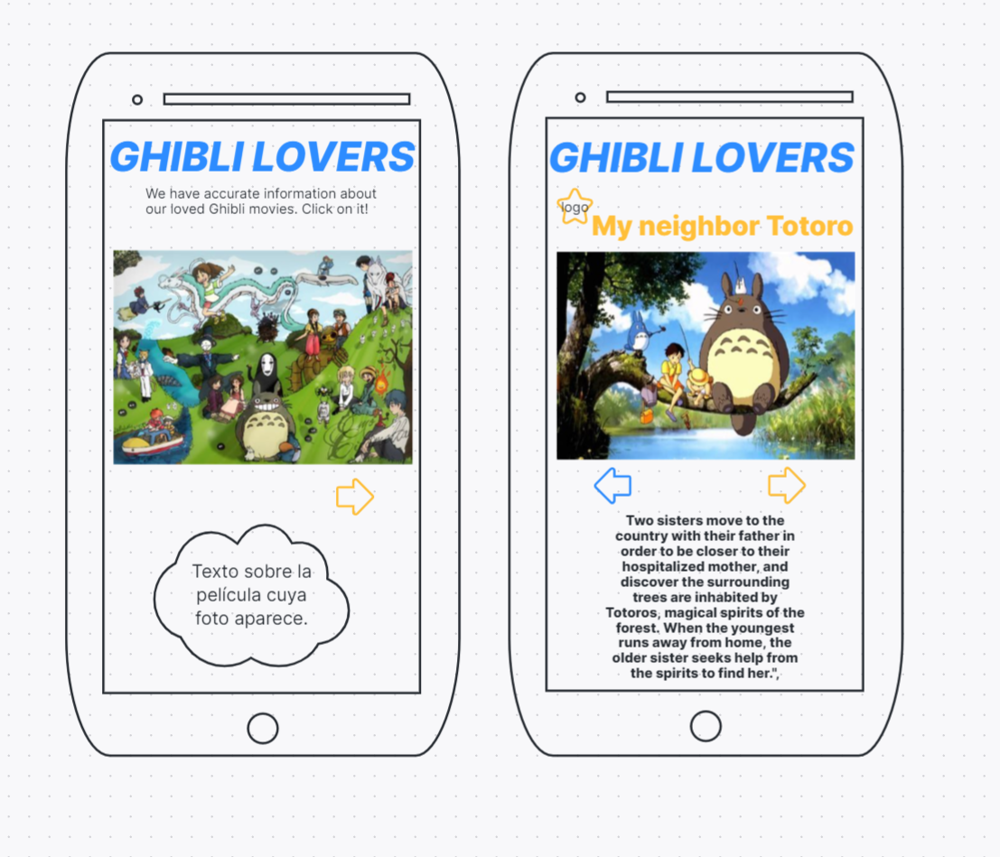

### DATA LOVERS / DATA GHIBLI

### DEFINICION DE PRODUCTO
La página tiene como objetivo brindar información a los visitantes sobre las películas realizadas por Estudio Ghibli a través de los años, desde su fundación en 1985.

Para la construcción de la página web 'Ghibli Lovers' realizamos un bosquejo inicial para entender cómo organizar y delimitar la información que mostraríamos en ella, además de tomar decisiones de diseño en cuanto a disposición de los espacios de caja, tipo de letra, íconos, paleta de colores, y en general, el diseño visual.

Posteriormente utilizamos la tecnología de la plataforma Figma para realizar un prototipo que se acercara más a la propuesta, donde además pudieramos evidenciar un diseño responsive, a partir de dos tamaños básicos (mobil y desktop).

Una vez realizados los prototipos procedimos a escribir el código base en HTML y CSS respondiendo a las ideas plasmadas en ellos.

### HISTORIAS DE USUARIO

## Historia de Usuario 1:
# YO COMO visitante de la web GHIBLI Lovers QUIERO un menú intuitivo PARA acceder a links de mi interés dentro y fuera de la página, en diferentes dispositivos.

Decidimos enfocar esta primera historia de usuario en algunos objetivos transversales que ambas teníamos pendientes desde el proyecto anterior, relacionados con CSS e interacción con el DOM. Adicionalmente, abordamos el manejo de GIT, creando las llaves SSH.

# Criterios de aceptación
.[x] El diseño del menú es responsive y difiere entre tamaños de pantalla.
.[x] El menú es de fácil acceso visual.
.[x] El menú se despliega y permite enlazarse a diferentes luegares web dentro y fuera de la página.
.[x] El menú aprueba al menos el 90% de las pruebas de usabilidad realizadas con 10 personas diferentes.
.[x] La página en general y el menú en particular responden a buenas prácticas de diseño visual.

## Historia de Usuario 2:
YO COMO visitante de la web Ghibli Lovers QUIERO visualizar unas tarjetas con información de las películas PARA obtener datos básicos sobre ellas y una segunda pantalla donde pueda ver datos específicos de la película que yo elija.

# Criterios de aceptación
.[] Las tarjetas están ubicadas en el home de la página y despliegan información básica sobre las películas. Además contienen un botón que enlaza con la tabla,          brindando información sobre la película elegida por el usuario.
.[] El link de películas de la página principal de la web Ghibli Lovers se conecta con la información de la API en una "tabla"
.[] La tabla ubicada en la segunda pantalla contiene la información de la película: Director, año de lanzamiento, personajes principales.
.[] La tabla tiene un estilo visual acorde al estilo definido en la página principal de Ghibli Lovers

***

## Definición de terminado
1. [ ] El código está respaldado en GitHub
2. [ ] La página es completamente responsive
3. [ ] La página se conecta a la API pública de Estudio Ghibli
4. [ ] *En la página puede filtrarse información solicitada por el usuario

### PROTOTIPO DE BAJA FIDELIDAD

### PROTOTIPO DE ALTA FIDELIDAD

### TESTEOS DE USABILIDAD
Durante el reto deberás hacer tests de usabilidad con distintos usuarios, y en base a los resultados, deberás iterar tus diseños. Cuéntanos qué problemas de usabilidad detectaste a través de los tests y cómo los mejoraste en tu propuesta final.